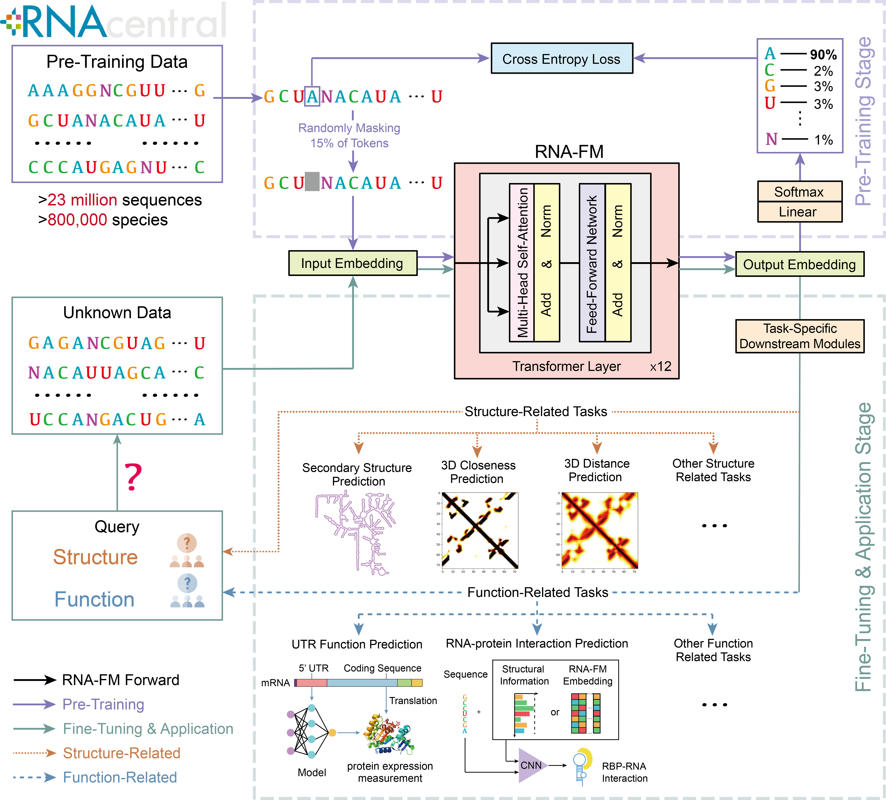

# RNA-FM
This repository contains codes and pre-trained models for **RNA foundation model (RNA-FM)**.
**RNA-FM outperforms all tested single-sequence RNA language models across a variety of structure prediction tasks as well as several function-related tasks.**
You can find more details about **RNA-FM** in our paper, ["Interpretable RNA Foundation Model from Unannotated Data for Highly Accurate RNA Structure and Function Predictions" (Chen et al., 2022).](https://arxiv.org/abs/2204.00300)



If you find the models useful in your research, we ask that you cite the relevant paper:

For RNA-FM:

```bibtex
@article{chen2022interpretable,
  title={Interpretable rna foundation model from unannotated data for highly accurate rna structure and function predictions},
  author={Chen, Jiayang and Hu, Zhihang and Sun, Siqi and Tan, Qingxiong and Wang, Yixuan and Yu, Qinze and Zong, Licheng and Hong, Liang and Xiao, Jin and King, Irwin and others},
  journal={arXiv preprint arXiv:2204.00300},
  year={2022}
}
```

The model of this code builds on the [esm](https://github.com/facebookresearch/esm) sequence modeling framework. 
And we use [fairseq](https://github.com/pytorch/fairseq) sequence modeling framework to train our RNA language modeling.
We very appreciate these two excellent works!
